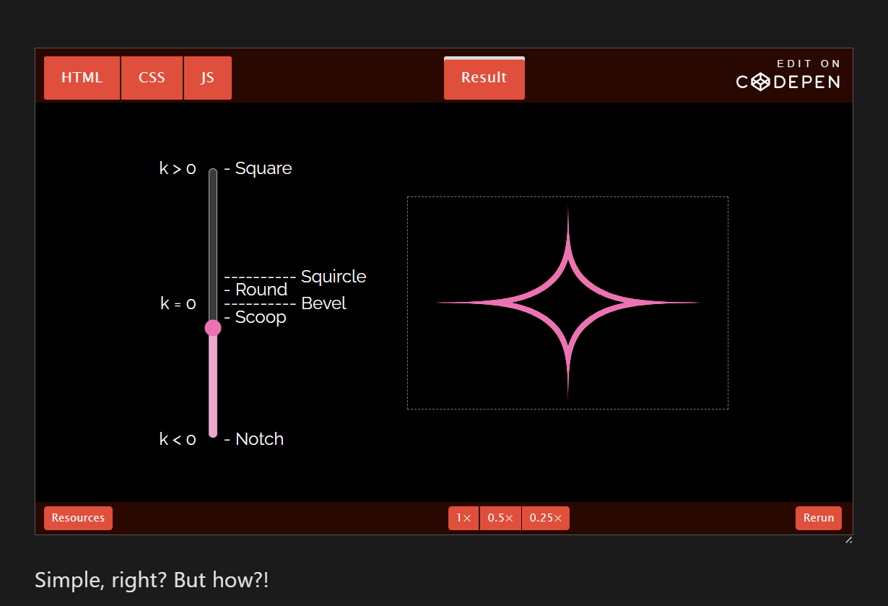
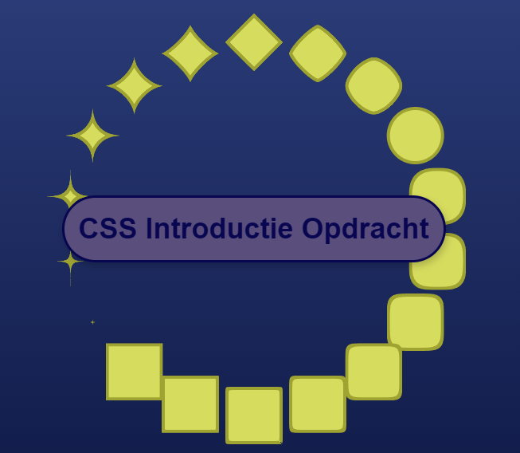
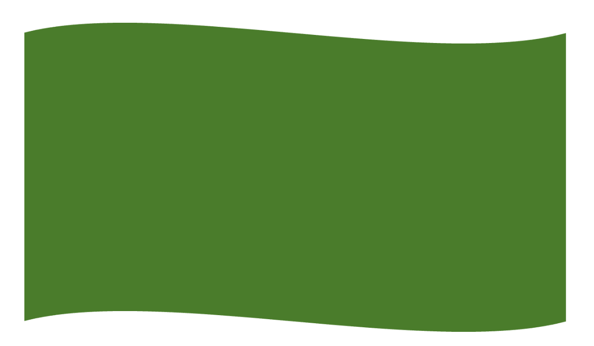
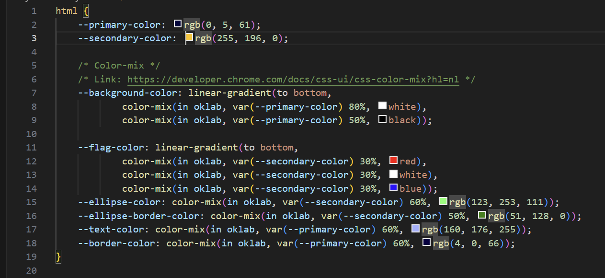
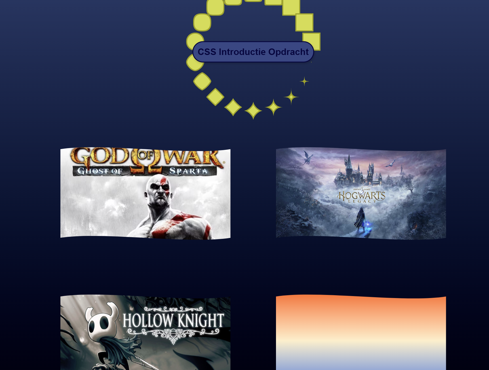
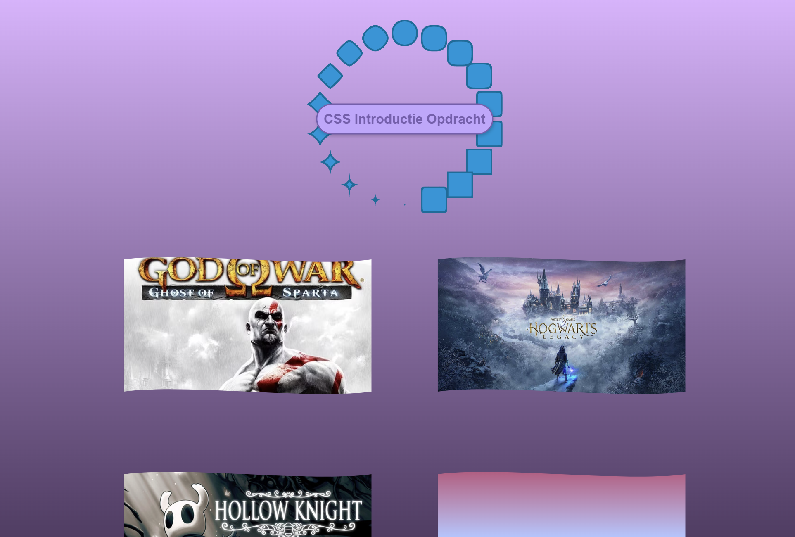
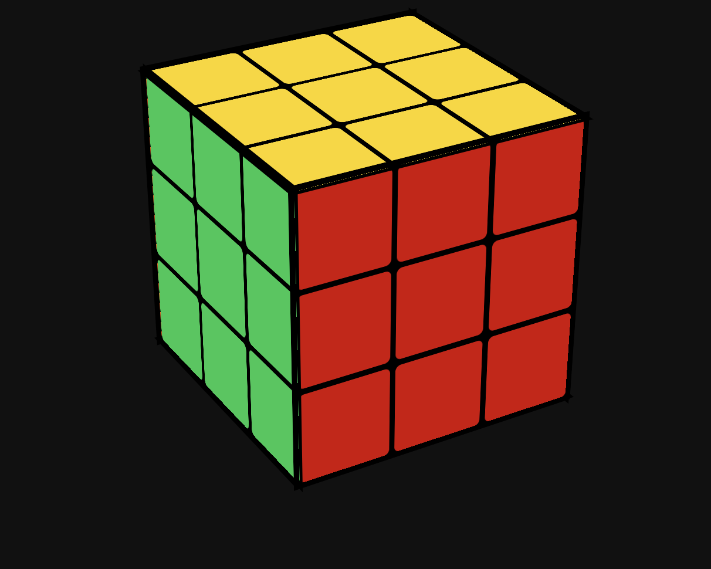

# Dylan-CSS-To The Rescue
Welkom bij mijn README over CSS To The Rescue

## Dag 1 (18 jan)
### Werkzaamheden
Start Introductie opdracht CSS
Groep met Naoufal & Alexia met als thema Makeup met Nils.
Binnen het thema heb ik gekozen voor Vormpjes en Color Functions

Vlag: Clip-path
Cirkel animatie: Corner Shapes & Super Ellipse 
Kleurenmix: colormix()

### Checkout met Naoufal, Alexia & Nils.
Uiteindelijk hebben we ons resultaat. Dit gaan we morgen presenteren. 

## Dag 2 (19 jan)
### Werkzaamheden
Vandaag hebben we de eerste helft van de dag besteed aan het presenteren van ons intro project. Helaas was 1 van onze teamgenoten, Naoufal, niet op school dus waren Alexia en ik met z'n tweeen. We hebben allebei ons eigen werk gepresenteerd en daarna heb ik het werk van Naoufal nog laten zien aan de klas.

Mijn eigen versie is hier te zien: https://dylanabrahams.github.io/Dylan-CSS-TtR/

Verder zijn we vandaag gestart met het eindproject. Ik kon kiezen uit 4 opdrachten en heb gekozen voor de Rubiks cubus. Ze hadden gewaarschuwd dat dit een best geadvanceerde opdracht was maar ik ben wel toe aan iets technisch bouwen en denk dat ik veel kan leren in iets complex maken zonder gebruik te kunnen maken van JavaScript. 

Verder moest ik een wiskunde opdracht doen om de kubus te mogen maken. Hij was niet heel moeilijk, ik moest alleen even goed lezen. Hier mijn notities:

- Klant geeft schoenmaker VALS 100
- Schoenmaker geeft VALS 100 aan buurman
- Buurman geeft 100 ECHT aan Schoenmaker
- Schoenmaker geeft 70 aan klant
- Schoenmaker geeft 100 aan buurman
- Schade = 70 euro + werk

Tot nu toe heb ik een 3D rubiks cubus gemaakt. Ik heb inspiratie gehaald uit deze codepen: https://codepen.io/anthoviso/pen/QByoLB?editors=1100.

Hij is al 3D en ik kan zijn rotatie in de code bepalen. De HTML bestaat voor nu uit een section met een article (dat is de kubus) met daarin 6 divs (de zijdes) waarvan elke 9 divs (de blokjes) heeft.

### Checkout met Jeppe
Ik kwam gerandomized met Iris, maar ik had dinsdag al samen met haar gedaan dus ik ben reruild samen met Jeppe. Ik heb laten zien wat ik had. We zitten allebei nog in de fase waarin we nog moeten bedenken wat we precies gaan doen. Ik ben wel al van plan om de kubus te doen, hij is van plan om de control panel te doen, maar met een abstracte artstijl waarin hij animaties kan besturen.

## Week 1 Overzicht
Deze week zijn we op woensdag en donderdag bezig geweest met CSS. Donderdag waren we bezig met de introopdracht, vrijdagochtend hebben we deze gepresenteerd en daarna zijn we gestart met het eindproject. 

Voor de introopdracht werd ik ingedeeld in een groep met Naoufal & Alexia met thema Makeup. Op DLO waren bij Makeup 7 onderdelen waar we mee bezig konden. Daarvan ben ikzelf bezig geweest met Vormpjes & Color Functions.

Vormpjes: Er waren 2 bronnen. 1 Ging over corner-shapes en de ander ging over clip-paths. Ik heb beide toegepast in mijn project. 

Voor de corner heb ik gebruik gemaakt van superellipses. Wat zijn dat? Simpel gezegd, bij waarde 0 (Bevel) heb je de hoeken aan de linker/rechter/boven/onderkant van het element, bij een positieve waarde (Square) komen de hoeken linksboven/rechtsonder etc. en bij negatief (Notch) worden de randen naar binnen gebracht, waardoor je een soort ster icoon hebt. 

Ik heb een animatie gemaakt waar een aantal corner shapes op volgorde van square naar notch gaan en snel weer terug. Verder staan de shapes in een cirkel, de locaties zijn bepaald door met translate eerst de rotatie te bepalen (rotate), daarna de afstand (translateY) en dan de rotatie terug te zetten (rotate) zodat ze allemaal recht staan.

Voor clip-path stond in het artikel een vlag animatie waarin je van een div een bewegende inham kan maken aan de boven en onderkant van de vlag.

Ik heb deze nagemaakt in een paar varianten. Ik heb 1 div (rechtsonder). Deze heb ik ook een gradient gegeven. Ik kon de snelheid en hoogtes aanpassen hoe ik wil. Verder heb ik het toegepast op 3 afbeeldingen. Deze afbeeldingen zijn de 3 favoriete games van ons groepje. De code werkt ook op imgs maar de image werd niet mee gesquisht, alleen gecropt. 

Verder was ik nog bezig met color-mixes. In mijn code kan ik bijvoorbeeld mijn primaire kleur mengen met andere kleuren op de site.

Als ik nu mijn primaire/secundaire kleuren aanpas worden de andere gemixte kleuren nu een combinatie van hun eigen kleur en de kleur die aangepast wordt. Hier kun je leuke combinaties mee maken.

Vrijdag ben ik begonnen met het eindproject. Ik heb gekozen voor de Rubiks kubus. Ze hadden gewaarschuwd dat dit een best geadvanceerde opdracht was maar ik ben wel toe aan iets technisch bouwen en denk dat ik veel kan leren in iets complex maken zonder gebruik te kunnen maken van JavaScript. Voor nu heb ik een 3D rubiks kubus waarvan je in de code de rotatie kan bepalen.

Op vrijdag hebben we nog gesprek gehad. Hieruit een paar inzichten: 
ipv 6 randen met 9 vlakjes

Doe 27 (of 26...?) blokes OF 54 vakjes

Begin met een 2x2x2

"article" gewoon veranderen naar "kubus"

## Bronnenlijst

Ellipses
Amit Sheen: corner-shape
Link: https://frontendmasters.com/blog/understanding-css-corner-shape-and-the-power-of-the-superellipse/
Codepen: https://codepen.io/amit_sheen/pen/pvJKGov/5d14d83481ba74eea561f08d81493614?editors=1100

DE VLAG
clip-path with shape()
Link https://developer.chrome.com/blog/css-shape?hl=nl#create_a_flag_shape
Codepen https://codepen.io/web-dot-dev/pen/YPzgNrL

Color-mix
Link: https://developer.chrome.com/docs/css-ui/css-color-mix?hl=nl

Codepen 2x2 Rubiks Cube die de muis volgt met CSS
Link: https://codepen.io/anthoviso/pen/QByoLB?editors=1100