# Dylan-CSS-To The Rescue
Welkom bij mijn README over CSS To The Rescue

## Dag 1 (18 februari)
### Werkzaamheden
Start Introductie opdracht CSS
Groep met Naoufal & Alexia met als thema Makeup met Nils.
Binnen het thema heb ik gekozen voor Vormpjes en Color Functions

Vlag: Clip-path
Cirkel animatie: Corner Shapes & Super Ellipse 
Kleurenmix: colormix()

### Checkout met Naoufal, Alexia & Nils.
Uiteindelijk hebben we ons resultaat. Dit gaan we morgen presenteren. 

## Dag 2 (19 februari)
### Werkzaamheden
Vandaag hebben we de eerste helft van de dag besteed aan het presenteren van ons intro project. Helaas was 1 van onze teamgenoten, Naoufal, niet op school dus waren Alexia en ik met z'n tweeen. We hebben allebei ons eigen werk gepresenteerd en daarna heb ik het werk van Naoufal nog laten zien aan de klas.

Mijn eigen versie is hier te zien: https://dylanabrahams.github.io/Dylan-CSS-TtR/

Verder zijn we vandaag gestart met het eindproject. Ik kon kiezen uit 4 opdrachten en heb gekozen voor de Rubiks cubus. Ze hadden gewaarschuwd dat dit een best geadvanceerde opdracht was maar ik ben wel toe aan iets technisch bouwen en denk dat ik veel kan leren in iets complex maken zonder gebruik te kunnen maken van JavaScript. 

Verder moest ik een wiskunde opdracht doen om de kubus te mogen maken. Hij was niet heel moeilijk, ik moest alleen even goed lezen. Hier mijn notities:

- Klant geeft schoenmaker VALS 100
- Schoenmaker geeft VALS 100 aan buurman
- Buurman geeft 100 ECHT aan Schoenmaker
- Schoenmaker geeft 70 aan klant
- Schoenmaker geeft 100 aan buurman
- Schade = 70 euro + werk

Tot nu toe heb ik een 3D rubiks cubus gemaakt. Ik heb inspiratie gehaald uit deze codepen: https://codepen.io/anthoviso/pen/QByoLB?editors=1100.

Hij is al 3D en ik kan zijn rotatie in de code bepalen. De HTML bestaat voor nu uit een section met een article (dat is de kubus) met daarin 6 divs (de zijdes) waarvan elke 9 divs (de blokjes) heeft.

### Checkout met Jeppe
Ik kwam gerandomized met Iris, maar ik had dinsdag al samen met haar gedaan dus ik ben reruild samen met Jeppe. Ik heb laten zien wat ik had. We zitten allebei nog in de fase waarin we nog moeten bedenken wat we precies gaan doen. Ik ben wel al van plan om de kubus te doen, hij is van plan om de control panel te doen, maar met een abstracte artstijl waarin hij animaties kan besturen.

## Week 1 Overzicht
Deze week zijn we op woensdag en donderdag bezig geweest met CSS. Donderdag waren we bezig met de introopdracht, vrijdagochtend hebben we deze gepresenteerd en daarna zijn we gestart met het eindproject. 

Voor de introopdracht werd ik ingedeeld in een groep met Naoufal & Alexia met thema Makeup. Op DLO waren bij Makeup 7 onderdelen waar we mee bezig konden. Daarvan ben ikzelf bezig geweest met Vormpjes & Color Functions.

Vormpjes: Er waren 2 bronnen. 1 Ging over corner-shapes en de ander ging over clip-paths. Ik heb beide toegepast in mijn project. 

Voor de corner heb ik gebruik gemaakt van superellipses. Wat zijn dat? Simpel gezegd, bij waarde 0 (Bevel) heb je de hoeken aan de linker/rechter/boven/onderkant van het element, bij een positieve waarde (Square) komen de hoeken linksboven/rechtsonder etc. en bij negatief (Notch) worden de randen naar binnen gebracht, waardoor je een soort ster icoon hebt. 

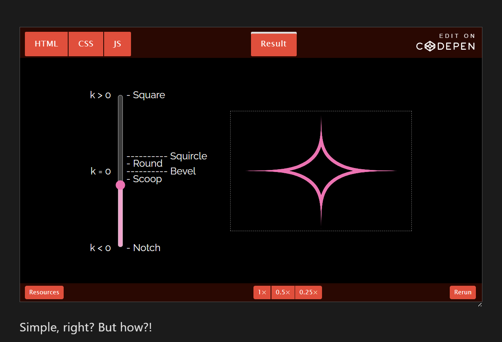

Ik heb een animatie gemaakt waar een aantal corner shapes op volgorde van square naar notch gaan en snel weer terug. Verder staan de shapes in een cirkel, de locaties zijn bepaald door met translate eerst de rotatie te bepalen (rotate), daarna de afstand (translateY) en dan de rotatie terug te zetten (rotate) zodat ze allemaal recht staan.

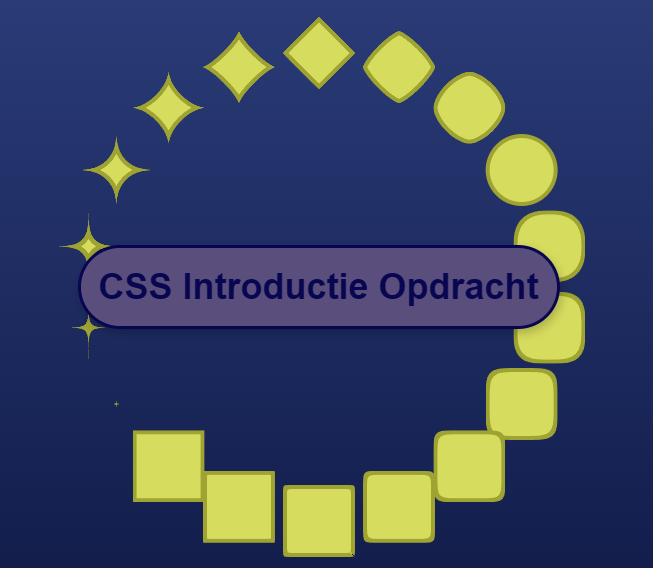

Voor clip-path stond in het artikel een vlag animatie waarin je van een div een bewegende inham kan maken aan de boven en onderkant van de vlag.

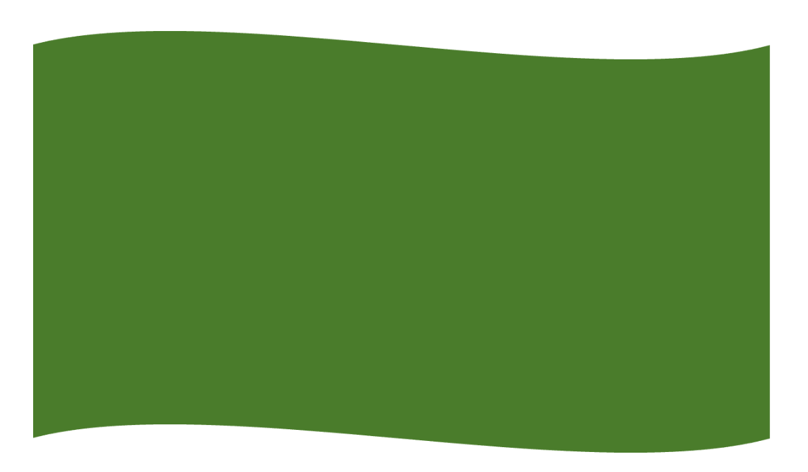

Ik heb deze nagemaakt in een paar varianten. Ik heb 1 div (rechtsonder). Deze heb ik ook een gradient gegeven. Ik kon de snelheid en hoogtes aanpassen hoe ik wil. Verder heb ik het toegepast op 3 afbeeldingen. Deze afbeeldingen zijn de 3 favoriete games van ons groepje. De code werkt ook op imgs maar de image werd niet mee gesquisht, alleen gecropt. 


Verder was ik nog bezig met color-mixes. In mijn code kan ik bijvoorbeeld mijn primaire kleur mengen met andere kleuren op de site.

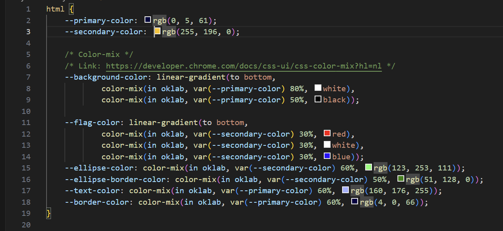

Als ik nu mijn primaire/secundaire kleuren aanpas worden de andere gemixte kleuren nu een combinatie van hun eigen kleur en de kleur die aangepast wordt. Hier kun je leuke combinaties mee maken.

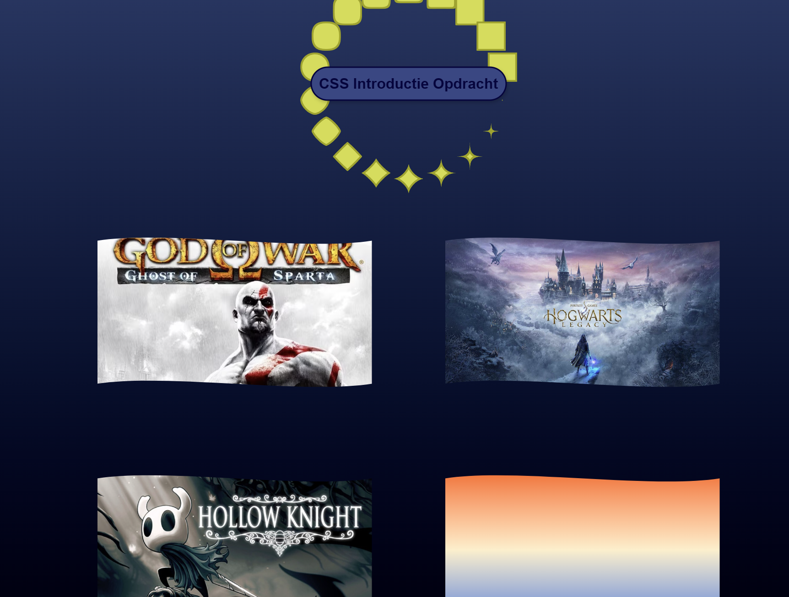
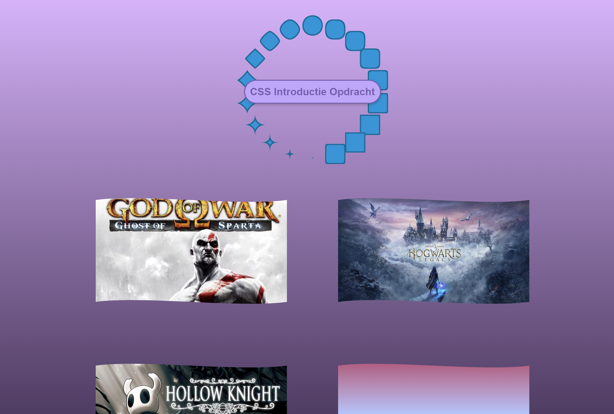

Vrijdag ben ik begonnen met het eindproject. Ik heb gekozen voor de Rubiks kubus. Ze hadden gewaarschuwd dat dit een best geadvanceerde opdracht was maar ik ben wel toe aan iets technisch bouwen en denk dat ik veel kan leren in iets complex maken zonder gebruik te kunnen maken van JavaScript. Voor nu heb ik een 3D rubiks kubus waarvan je in de code de rotatie kan bepalen.

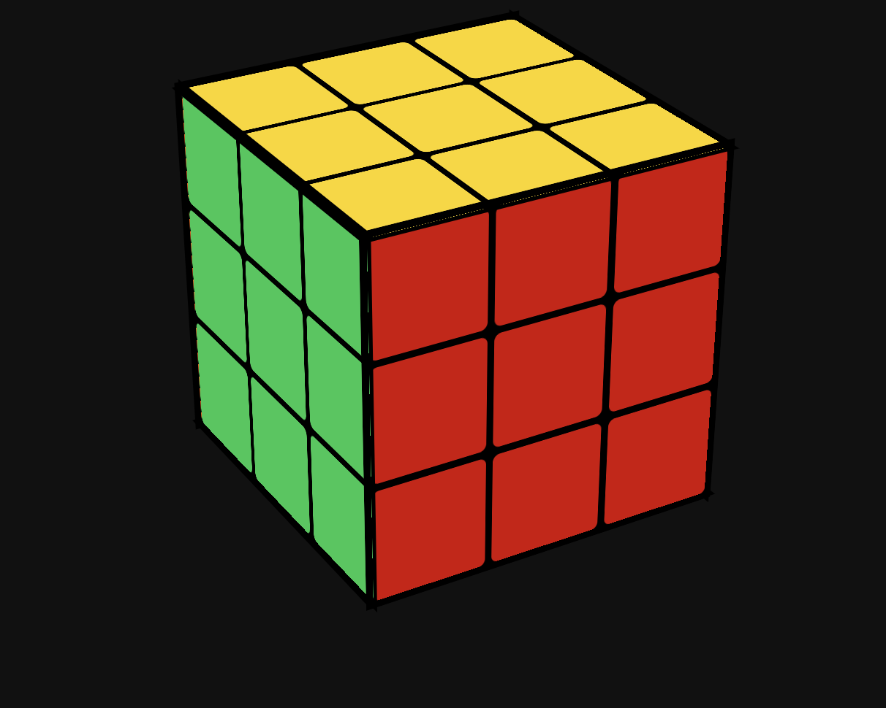

Op vrijdag hebben we nog gesprek gehad. Hieruit een paar inzichten: 
ipv 6 randen met 9 vlakjes

Doe 27 (of 26...?) blokes OF 54 vakjes

Begin met een 2x2x2

"article" gewoon veranderen naar "kubus"

ARCHIVE OUDE CODE

```    <section>
        <article>
            <div>
                <div></div>
                <div></div>
                <div></div>
                <div></div>
                <div></div>
                <div></div>
                <div></div>
                <div></div>
                <div></div>
            </div>
            <div>
                <div></div>
                <div></div>
                <div></div>
                <div></div>
                <div></div>
                <div></div>
                <div></div>
                <div></div>
                <div></div>
            </div>
            <div>
                <div></div>
                <div></div>
                <div></div>
                <div></div>
                <div></div>
                <div></div>
                <div></div>
                <div></div>
                <div></div>
            </div>
            <div>
                <div></div>
                <div></div>
                <div></div>
                <div></div>
                <div></div>
                <div></div>
                <div></div>
                <div></div>
                <div></div>
            </div>
            <div>
                <div></div>
                <div></div>
                <div></div>
                <div></div>
                <div></div>
                <div></div>
                <div></div>
                <div></div>
                <div></div>
            </div>
            <div>
                <div></div>
                <div></div>
                <div></div>
                <div></div>
                <div></div>
                <div></div>
                <div></div>
                <div></div>
                <div></div>
            </div>
        </article>
    </section>    
```

```
html {
    --background-color: #111;

    --red-color: #d50000;
    --orange-color: #ff6d00;
    --blue-color: #2962ff;
    --green-color: #00c853;
    --yellow-color: #ffd600;
    --white-color: white;
}

body {
  background: var(--background-color);
  color: white;
  font-family: Arial, sans-serif;
  text-align: center;
}

/* Scene */
section {
  width: 300px;
  height: 300px;
  margin: 60px auto;
  perspective: 1200px;
  transform-style: preserve-3d;
}

article {
  width: 200px;
  height: 200px;
  position: relative;
  margin: 0 auto;
  transform-style: preserve-3d;
  transition: transform 1s ease;
  /* Schuin zodat front, right en top zichtbaar zijn */
  transform: rotateX(-35deg) rotateY(45deg);
}

/* Faces */
article > div {
  position: absolute;
  width: 200px;
  height: 200px;
  display: grid;
  grid-template-columns: repeat(3, 1fr);
  gap: 4px;
  padding: 4px;
  background: black;
}

article > div > div { border-radius: 4px; }

article > div:nth-child(1) { transform: rotateY(0deg) translateZ(100px); }
article > div:nth-child(2) { transform: rotateY(180deg) translateZ(100px); }
article > div:nth-child(3) { transform: rotateY(90deg) translateZ(100px); }
article > div:nth-child(4) { transform: rotateY(-90deg) translateZ(100px); }
article > div:nth-child(5) { transform: rotateX(90deg) translateZ(100px); }
article > div:nth-child(6) { transform: rotateX(-90deg) translateZ(100px); }

/* Colors */
article > div:nth-child(1) div { background: var(--red-color); }
article > div:nth-child(2) div { background: var(--orange-color);; }
article > div:nth-child(3) div { background: var(--blue-color);; }
article > div:nth-child(4) div { background: var(--green-color);; }
article > div:nth-child(5) div { background: var(--yellow-color);; }
article > div:nth-child(6) div { background: var(--white-color);; }

```

## Dag 3 (4 maart)
Vandaag ben ik verder gegaan met de Rubiks kubus opdracht. Ik moet mijn kubus anders inrichten dus ik ben weer opnieuw begonnen. Ten eerste heb ik nu custom HTML elementen gebruikt zoals <cube>, <block> en <face>. Dit is toegestaan. Verder heb ik nu mijn kubus ingericht per block ipv per zijkant. Daarnaast heb ik voor nu een 2x2x2 kubus gemaakt. De kubus is opgericht uit 8 blokken die elk zijn opgericht uit 6 zijdes. Met query selectors wordt per block/zijde bepaald welke kleur deze moet zijn. 

Het duurde even voordat de kubus er goed zag maar uiteindelijk na wat gesleutel heb ik de kubus correct ingesteld. Verder staat deze in een scene met een perspectief van 50em. 

Vervolgens heb ik een animatie gemaakt voor de kubus. Ik heb ervoor gezorgd dat de voorkant/rechterkant van de kubus ging draaien dmv keyframes. Hier ben ik wel lang mee bezig geweest want ik moest ze niet alleen om hun eigen as te laten draaien maar om het middenpunt van alle blokjes. Uiteindelijk heb ik met custom properties ervoor kunnen zorgen dat de posities van de blokjes geupdatet kunnen worden.

Uiteindelijk heb ik wat checkboxes ervoor gezorgd dat de kubus zou draaien wanneer je op een checkbox klikt. Ik was zelf even vergeten dat dit zonder IDs kon. Sanne heeft mij herinnert aan de :has() functie, waarmee het gelijk wel lukte. Verder was het ook gelukt om per checkbox een aparte waarde te geven. 

Checkbox A roteert te kubus van 0 graden naar 90, checkbox B van 90 naar 180. Ik wil elke checkbox dynamisch in beeld laten wanneer deze relevant wordt. Verder moet ik er voor zorgen dat je meerdere rotaties kan doen (links/rechts) en terug kan draaien. Misschien zelfs ook de boven/onderkant. Daarnaast wil ik een ook een 3x3 proberen.


https://developer.mozilla.org/en-US/docs/Web/CSS/Reference/Selectors/:has


### Checkout met Julius
Hij had eerst Rubiks cube, is nu overgestapt naar Control Panel

## Dag 4 (5 maart)
Vandaag moest ik naar de tandarts om een gaatje te vullen dus ben ik thuis gaan werken. Verder was dit niet mijn meest productieve dag. Ik heb vooral de tijd genomen om mijn code goed op orde te hebben en wat minimale veranderingen te maken. Zo heb ik nu bijvoorbeeld radio buttons ipv checkboxes. Dit had ik eigenlijk gelijk moeten doen want het heeft denk ik toch niet veel zin om meerdere checkboxes tegelijk aan te vinken, anders zou alles wel heel snel breken. 

Verder heb ik al mijn code over keyframes eruit gehaald toen ik zag dat ik alleen maar 0% en 100% aan het gebruiken was. Toen ik nog geen knop had gebruikte ik 5 verschillende percentages zodat de kubus helemaal rond zou draaien maar nu heb ik alleen maar een transitie voor de positie/rotatie die wordt toegepast wanneer ik op de knop druk. 

Nu heb ik een interface waarin ik 5 radio knoppen in beeld heb en elke knop de rotatie van de kubus aanpast naar gewenst aantal graden. Ik heb voor nu zowel een 0deg als een 360deg waar virtueel geen verschil in zit maar omdat de animatie anders terug zou draaien ipv verder heb ik een tussenstap erin gezet. Later ga ik kijken of ik automatisch hem naar 0deg kan zetten zodra hij 360 wordt zonder de transitie.


## Week 2 Overzicht

Deze week ben ik opnieuw begonnen met mijn rubiks kubus. In de HTML heb ik de kubus opgedeeld in blokken in plaats van zijdes met vakjes, verder is elk blok opgedeeld in 6 zijdes. Ik ben begonnen met een 2x2x2 aangezien deze simpeler is om te programmeren met maar 8 blokjes vergeleken met de 27 (of 26) van de 3x3x3. 

Ik ben begonnen met deze te bouwen in HTML. Ik gebruik nu custom HTML elementen zoals <cube> en <block> zodat ik het wat makkelijker voor mezelf maak in CSS. Het heeft even geduurt en er waren een paar bugs waaronder kleuren die aan de verkeerde kant stonden, binnen/buitenkant etc.

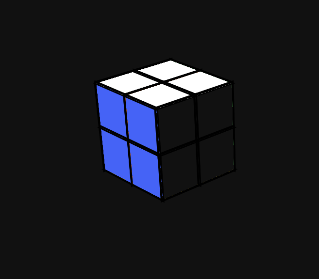
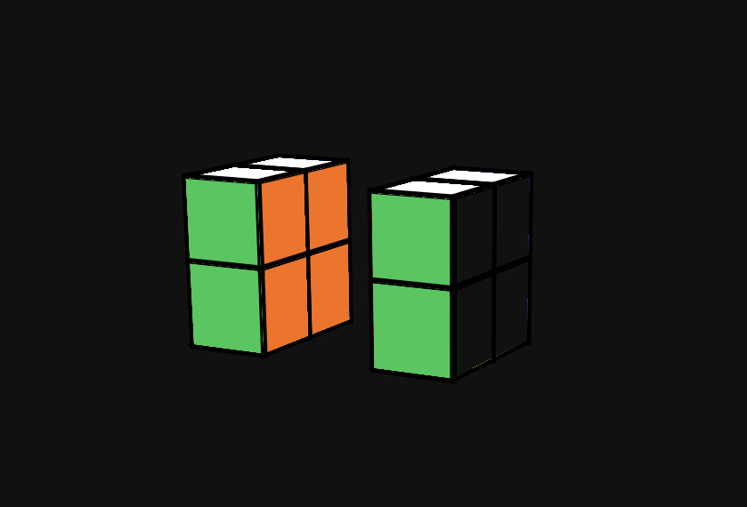

Uiteindelijk ben ik tot een goede 2x2x2 gekomen. Deze bestaat uit een scene met een perspectief van 50em met daarin een kubus met transform-style: preserve-3d en 45 graden gedraaid. Hierin zitten de 8 blokjes die allemaal een eigen transform hebben met verschillende waardes voor TranslateX, Y en Z. Vervolgens heeft elk blok 6 zijdes die allemaal een eigen rotatie en positie hebben, ook met transform.
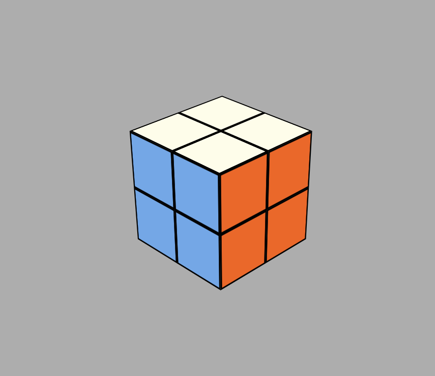


Vervolgens ben ik begonnen met de animatie voor het roteren van de kubus. Ik heb code geschreven voor 4 van de 8 blokken om te rond te draaien dmv keyframes. Het duurde even om dit werkent te krijgen, de blokken gingen vaak of niet bewegen of alleen maar om hun eigen as net als de afbeelding hieronder.

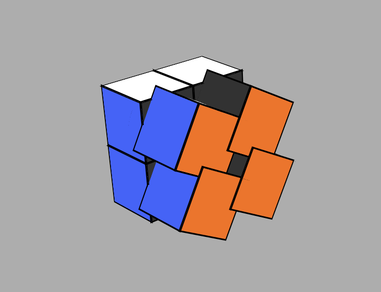

Op een gegeven moment had ik het werkend gekregen door de posities van de kubus op te slaan met custom properties en deze te updaten voor elk blok. Ik heb nu een vloeiende animatie voor het roteren van een zijde. Hij is nog niet perfect, maar daar ga ik volgende week naar kijken.

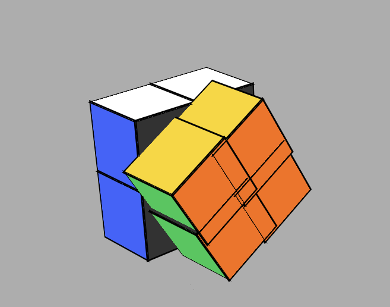

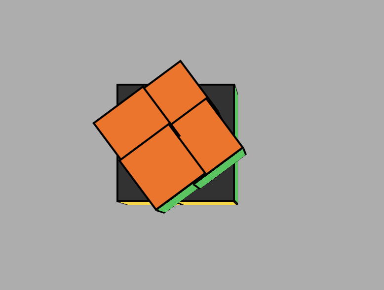

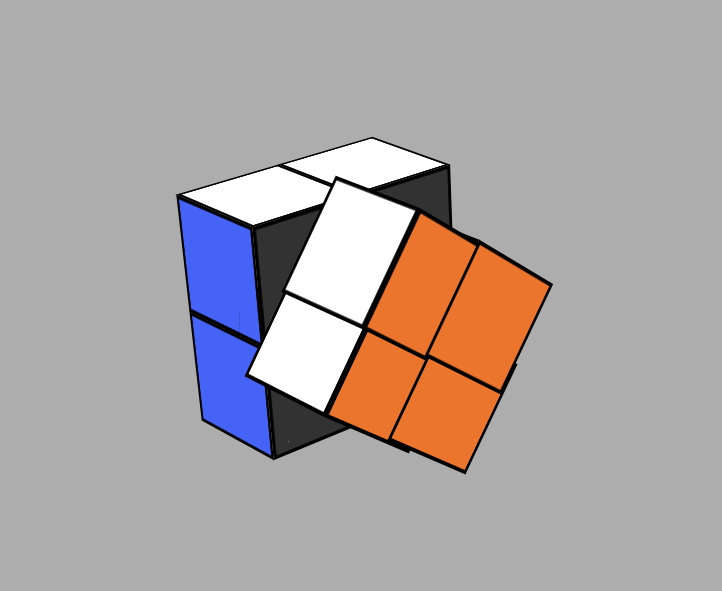

Verder heb ik geprogrammeerd wanneer je een checkbox inklikt de blokjes naar een specifieke waarde draaien. Dit is gedaan met de :has() functie. Ik gebruik nu transities hiervoor ipv keyframes aangezien het maar 1 animatie is. Verder kan hij ook terugdraaien de andere kant op. Ik heb helaas geen afbeelding van het testen met checkboxes want ik heb ze op een gegeven moment vervangen met radio buttons. Omdat ik van plan ben om maar 1 waarde per keer te gebruiken lijken radios veel handiger.


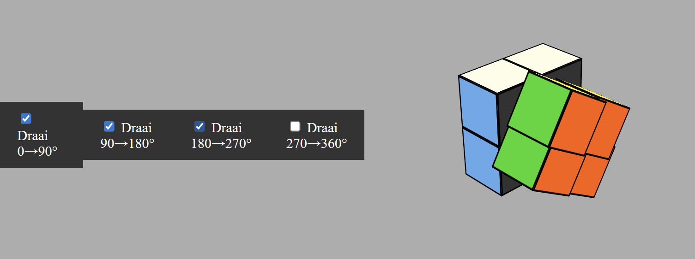

Op vrijdag heb ik het gesprek gehad met mijn clubje & Sanne. Hiervan wat aantekeningen:

Variabel fonts installeren waarvan je de width/weight kan animeren
De animaite KAN perfect, woensdag met Sanne praten
Custom properties voor aantal grades 
Die custom properties van transform kun je ook eerder definieren 

## Dag 5 (11 maart)
### Werkzaamheden
Vandaag zijn we begonnen met een "Short" (1 uur) Talk over het gebruik van kleur in css. Sanne had uitleg gegeven over RGB, HSL, OKLCH, color-mix etc. Vervolgens heb ik ook een achtergrondje in mijn site gezet, want ik vond mijn grijze achtergrond een beetje saai worden. Ik heb hier een gradient in OKLCH voor gebruikt.

Ik had in de ochtend nog geen zin om verder te gaan met de rubiks kubus in elkaar zetten en was begonnen aan de titel van de site. Deze moest sensationeel zijn en bij het concept passen. Ik heb als titel voor mijn website de naam CUBIFY, want ik wilde een naam van 6 letters, 1 voor elke kleur op de kubus. Elke letter zit op een aparte kubus met een eigen kleur die correspondeert met een zijde van de hoofdkubus. Verder heb ik deze allemaal een animatie gegeven waardoor ze nu een beetje op en neer bewegen en ronddraaien alsof ze door de ruimte zweven. Ik ben blij met het resultaat, ik ga wel nog een lettertype ervoor geven en misschien nog met de kleuren spelen. Ik had wel nog een schaduw toegevoegd aan alle kubussen. Nu matchen ze ook wat meer met de achtergrond.

Verder ben ik vandaag bezig geweest met de kubus zelf. Ten eerste heb ik aan de radio buttons gezeten. Ik heb nu code om alleen de VORIGE en de VOLGENDE knop te laten zien. Alle andere knoppen hebben dan display:none. Voor elke radio button is er aparte css code voor de positie, rotatie en welke andere knoppen dan zichtbaar zijn. Verder heb ik ook een order gegeven aan bepaalde knoppen. Als je bv. op 360 graden zit, is 270 graden te VORIGE knop, waardoor hij links hoort te staan ipv rechts.

Ten slotte ben ik begonnen met een nieuwe zijde te draaien. Dit is helaas nog niet gelukt. Als ik dezelfde code toepas maar dan voor bovenste zijde van de kubus ipv de voorste zijde (en alle posities/rotaties correct zijn) zorgt het ervoor dat die draai goed gaat, maar dat de draai van de voorkant alleen effect heeft op de 2 blokken voor- en onderin, want de andere 2 blokken worden overschreven. Ik heb een aantal dingen geprobeerd om dynamisch de waardes van de 2 draaien op te tellen. Het lukte wel voor de rotaties, maar niet voor de posities dus dit was ook niet wat het wezen moet. Ik ben nu bezig om voor alle combinaties een eigen specifike positie en rotatie te geven. Hier ga ik morgen mee verder.

Ik had mijn code trouwens ook een beetje verschoond, Sanne zei vrijdag dat ik de posities van de blokken ergens anders in de code had kunnen doen en dat zag ik nu zelf ook. Ze werden al gedefinieerd maar later in het script had ik custom properties gemaakt waardoor het een beetje dubbelop was. Is nu gefixt.

### Checkout met Eva
Vandaag werd ik gerandomized met Eva. Zij is bezig met de silly walk. Zij heeft een klein beestje voor de silly walk opdracht. Ze heeft weinig ervaring met code dus voor haar is css al heel wat. Ik heb zelf laten zien wat ik nu heb en waar ik nog mee bezig wil zijn.
Ik ben vandaag niet bezig geweest met de draai animatie dus daar wil ik morgen nog naar gaan kijken en verder zou ik heel graag morgen de bovenkant draai gefixt willen hebben.

### Weekly Nerd 4 - Robbert Boersma
Aan het einde van de dag hadden we de weekly nerd. Deze ging over formuliers. Mijn notitites voor de weekly nerd staan in een kladblok.

## Dag 6 (12 maart)
### Werkzaamheden
Vandaag zijn we begonnen met een short talk over wiskunde in css. Het was wel interessant om te zien hoe je sinus gebruikt in css ontwerpen, maar op dit moment helaas niet al te relevant op dit moment. Wel ben ik zelf bezig met calc en custom properties, dus ik kon daar wel wat inzichten van op doen.

Vandaag ben ik de hele dag bezig geweest met de kubus en hem meerdere kanten te laten draaien. De hele ochtend ben ik bezig geweest om hem werkend te maken op de manier hoe ik dat eerst had. Ik had 2 divs met daarin 5 radios. 1 voor de voorkant en 1 voor de bovenkant. Ze werken allebei individueel maar helaas niet bij elkaar. Bijvoorbeeld bovenkant 90 graden gedraaid eb voorkant 180 graden gedraaid werkte totaal niet, de kubus werd gesloopt. De code die ik had om de 2 radios te checken met :has() werkte wel, maar het was niet overzichtelijk. Ik ben dus van strategie gewisseld.

Ik heb besloten om meer radios te maken. Ik heb nu 25 buttons, ze zijn verdeeld in divs in groepen van 5 maar behoren wel tot dezelfde radio groep. Bovenaan staan 5 radios om de bovenkant draaien (elke keer 90 draden). Vervolgens voor alle 5 standen kun je de voorkant draaien. Na heel veel proberen is het me eindelijk gelukt om een kant te draaien en vanuit daar een andere kant op te draaien. Het is totaal niet effecient. Ik moet voor elke radio button voor elk blok een specifieke waarde zetten. Dit is nog een 2x2x2, die bestaat uit 8 blokken, waarvan ik er 6 beweeg. Laat staan een 3x3x3 die er 26 heeft... Ik had graag een 3x3x3 gemaakt maar ik denk niet dat dat hem nog gaat worden. 
Momenteel heb ik van deze 25 radio buttons 13 knoppen werkens. Ik kan mijn kubus nu 1-4 keer de bovenkant draaien en vervolgens 2 keer de voorkant draaien. Ik wil in ieder geval de radios die ik nu heb allemaal uitwerken. Voor ze allemaal moet ik dan per blok hun positie en rotatie bepalen. Misschien ga ik dan nog meer opties toevoegen om daarna nog een keer de bovenkant te draaien, moet ik nog zien. Ik wil wel nog toevoegen dat je alleen de radio buttons zien van de draaings die goed zullen werken. Dit had ik al toen er nog maar 5 buttons waren dus ik moet die code opnieuw toepassen.

Ik ben niet bezig geweest met het fixen van de animatie, want daar lag persoonlijk mijn prioriteit niet. Daarnaast zou het waarschijnlijk een verschrikkelijke klus zijn om AL mijn radio buttons aan te passen, want deze hebben momenteel allemaal een transitie voor hun kubus. Tenzij dit heel snel kan laat ik dat links. 

## Week 3 Overzicht
Mijn doel van deze week was om de kubus meerdere keren te kunnen draaien. Dit is gelukt. Na veel gestoeid te hebben met 2 radio groups (1 voor voorkant, 1 voor bovenkant) heb ik uiteindelijk besloten om elke positie/rotatie een eigen radio button te geven. Ik heb nu 25 radio buttons. Eerst 5 om de rotatie van de voorkant te bepalen en vervolgens voor alle 5 kun je rotatie van de bovenkant bepalen. Hier ben ik een deel van woensdag, HEEL donderdag en vrijdag ochtend mee bezig geweest. Ik heb dus voor elke radio button de positie en rotatie van ELK individueel blok ingesteld. Dit is ~450 regels aan CSS. 


Vrijdag gesprek met clubje


### Checkout met Julius
Vandaag werd ik gerandomized met Julius. Hij is bezig geweest met zijn control panel nadat hij was gestopt met de rubiks kubus. Hij is bezig met een schakelaar te maken op de manier hoe Sanne die in zijn codepen had. Ik heb hem laten zien wat ik had. Hij vond dat ik al veel had en goed opweg was. Mijn doel is om in ieder geval alle radios die ik nu heb af te maken en aan alle eisen te doen waaronder nog een thema. Hij kwam nog met het idee om memes voor de blokjes te doen als thema, lijkt me wel geinig. 

### Week 3 Overzicht


## Bronnenlijst

Ellipses
Amit Sheen: corner-shape
Link: https://frontendmasters.com/blog/understanding-css-corner-shape-and-the-power-of-the-superellipse/
Codepen: https://codepen.io/amit_sheen/pen/pvJKGov/5d14d83481ba74eea561f08d81493614?editors=1100

DE VLAG
clip-path with shape()
Link https://developer.chrome.com/blog/css-shape?hl=nl#create_a_flag_shape
Codepen https://codepen.io/web-dot-dev/pen/YPzgNrL

Color-mix
Link: https://developer.chrome.com/docs/css-ui/css-color-mix?hl=nl

:has()
Link: https://developer.mozilla.org/en-US/docs/Web/CSS/Reference/Selectors/:has

Codepen 2x2 Rubiks Cube die de muis volgt met CSS
Link: https://codepen.io/anthoviso/pen/QByoLB?editors=1100